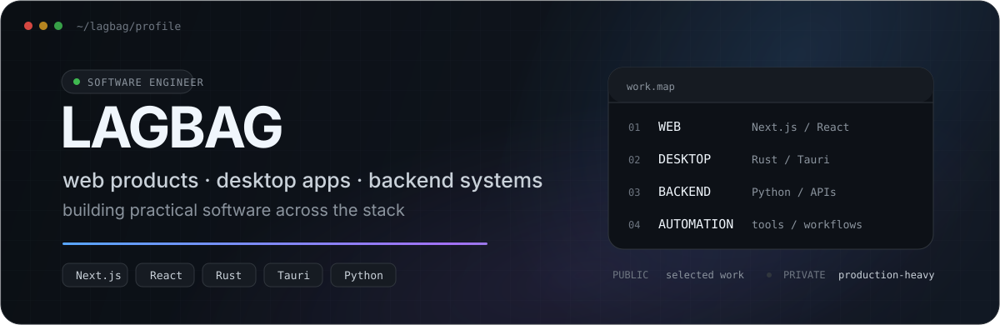
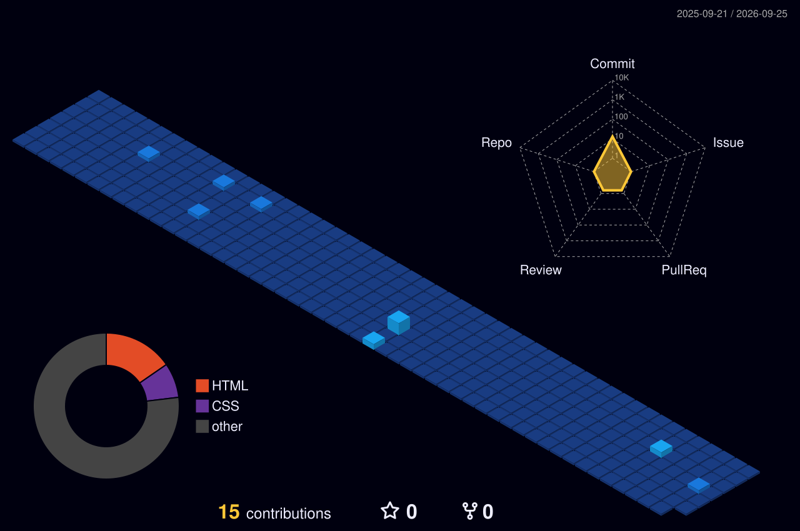

  

 

  I build software end-to-end — <b>web products, desktop apps, backend systems and automation</b>.
   
  Product UI when it needs a browser. Rust when it deserves a binary.

  
  

## Engineering map

<table>
<tr>
<td width="50%" valign="top">

### Web products

Interfaces and full-stack product work with **Next.js** and **React**, connected to real APIs and business workflows.

`Next.js` `React` `Web` `API integration`

</td>
<td width="50%" valign="top">

### Desktop & systems

Native-feeling tools and utilities with **Rust** and **Tauri**, where performance, packaging and local capabilities matter.

`Rust` `Tauri` `Desktop` `Async`

</td>
</tr>
<tr>
<td width="50%" valign="top">

### Backend

APIs, integrations and data-heavy services built around **Python**, **FastAPI**, **Django** and **PostgreSQL**.

`Python` `FastAPI` `Django` `PostgreSQL`

</td>
<td width="50%" valign="top">

### Automation & infrastructure

Internal tools, marketplace workflows, background jobs and the plumbing that keeps them running.

`Docker` `Redis` `RabbitMQ` `Linux`

</td>
</tr>
</table>

> **Most of my active production work lives in private repositories.**  
> The public profile is a selected set of tools and experiments — not a complete map of the stack I work with day to day.

## Stack

  

## Selected public work

<table>
<tr>
<td width="33%" valign="top">

### [WBUploadManager](https://github.com/Lagbag/WBUploadManager)

Desktop automation for Wildberries media workflows — Yandex Disk/local files, vendor-code matching and API uploads.

**Rust · egui · reqwest · Wildberries API**

</td>
<td width="33%" valign="top">

### [HunterAI](https://github.com/Lagbag/HunterAI)

Web application for object detection in images and video, including YouTube input and YOLOv8 processing.

**Python · FastAPI · YOLOv8 · FFmpeg**

</td>
<td width="33%" valign="top">

### [FastAPIFacePlusPlus](https://github.com/Lagbag/FastAPIFacePlusPlus)

Face++ integration exposed through a FastAPI service with persistent storage and containerized setup.

**FastAPI · PostgreSQL · Docker · API integration**

</td>
</tr>
</table>

## What I optimize for

- **Useful software over demo software** — tools should remove real work, not just look good in a screenshot.
- **Simple architecture first** — add complexity when the problem earns it.
- **End-to-end ownership** — UI, API, data, packaging and deployment are parts of the same product.
- **Automation by default** — repetitive manual work is usually a missing tool.

## Activity

  

---

  web · desktop · backend · automation

